# 📊 Informe Integral de Auditoría de Calidad, Viabilidad y Análisis DAFO del Curso

**Curso:** Python para la Ciencia Abierta (CSIC 2026)  
**Autor:** Gustavo Liñán Cembrano  
**Fecha de Auditoría:** 28 de Septiembre de 2026  
**Cuadernos Evaluados:** 15 (`NOTEBOOKS/00` al `14`)  

> [!TIP]
> **VERDICTO DEL AGENTE AUDITOR (`@auditor_curso`):**  
> **APROBADO CON EXCELENCIA — CURSO 100% VIABLE, SINTÁCTICAMENTE VERIFICADO Y TOTALMENTE AUDITADO.**

---

## 🔍 1. Auditoría Sintáctica de Código (AST) y Estado de Cuadernos

- **Total Cuadernos:** 15
- **Total Celdas:** 543 (282 celdas de código Python)
- **Tasa de Éxito Sintáctico (AST):** **100.0%** (0 errores sintácticos)
- **Seguridad:** 0 API keys o credenciales privadas expuestas.

| Cuaderno | Celdas Total | Celdas Código | Sintaxis Python | Cabecera CSIC 2026 | Seguridad Keys | Hipervínculos |
|---|---|---|---|---|---|---|
| [`00_SETUP_Y_EJEMPLO_INICIAL.ipynb`](file:///Users/linan/Desktop/RESEARCH/FORMACION/PYTHON_PARA_CIENCIA_ABIERTA_2/NOTEBOOKS/00_SETUP_Y_EJEMPLO_INICIAL.ipynb) | 28 | 12 | ✅ 0 Errores | ✅ Conforme | ✅ Segura | 4 |
| [`01_Intro_Tipos_Datos.ipynb`](file:///Users/linan/Desktop/RESEARCH/FORMACION/PYTHON_PARA_CIENCIA_ABIERTA_2/NOTEBOOKS/01_Intro_Tipos_Datos.ipynb) | 28 | 15 | ✅ 0 Errores | ✅ Conforme | ✅ Segura | 3 |
| [`02_ESTRUCTURAS_DATOS.ipynb`](file:///Users/linan/Desktop/RESEARCH/FORMACION/PYTHON_PARA_CIENCIA_ABIERTA_2/NOTEBOOKS/02_ESTRUCTURAS_DATOS.ipynb) | 115 | 82 | ✅ 0 Errores | ✅ Conforme | ✅ Segura | 3 |
| [`03_SCRIPTS_Y_FUNCIONES.ipynb`](file:///Users/linan/Desktop/RESEARCH/FORMACION/PYTHON_PARA_CIENCIA_ABIERTA_2/NOTEBOOKS/03_SCRIPTS_Y_FUNCIONES.ipynb) | 35 | 16 | ✅ 0 Errores | ✅ Conforme | ✅ Segura | 2 |
| [`04_CONTROL_DEL_FLUJO.ipynb`](file:///Users/linan/Desktop/RESEARCH/FORMACION/PYTHON_PARA_CIENCIA_ABIERTA_2/NOTEBOOKS/04_CONTROL_DEL_FLUJO.ipynb) | 77 | 40 | ✅ 0 Errores | ✅ Conforme | ✅ Segura | 2 |
| [`05_INTRO_A_POO.ipynb`](file:///Users/linan/Desktop/RESEARCH/FORMACION/PYTHON_PARA_CIENCIA_ABIERTA_2/NOTEBOOKS/05_INTRO_A_POO.ipynb) | 14 | 6 | ✅ 0 Errores | ✅ Conforme | ✅ Segura | 3 |
| [`06_INTRO_A_PANDAS.ipynb`](file:///Users/linan/Desktop/RESEARCH/FORMACION/PYTHON_PARA_CIENCIA_ABIERTA_2/NOTEBOOKS/06_INTRO_A_PANDAS.ipynb) | 48 | 29 | ✅ 0 Errores | ✅ Conforme | ✅ Segura | 2 |
| [`07_EDA_CON_PANDAS.ipynb`](file:///Users/linan/Desktop/RESEARCH/FORMACION/PYTHON_PARA_CIENCIA_ABIERTA_2/NOTEBOOKS/07_EDA_CON_PANDAS.ipynb) | 43 | 26 | ✅ 0 Errores | ✅ Conforme | ✅ Segura | 2 |
| [`08_INTRO_MATPLOTLIB.ipynb`](file:///Users/linan/Desktop/RESEARCH/FORMACION/PYTHON_PARA_CIENCIA_ABIERTA_2/NOTEBOOKS/08_INTRO_MATPLOTLIB.ipynb) | 28 | 16 | ✅ 0 Errores | ✅ Conforme | ✅ Segura | 8 |
| [`09_INTRO_GOOGLE_COLAB.ipynb`](file:///Users/linan/Desktop/RESEARCH/FORMACION/PYTHON_PARA_CIENCIA_ABIERTA_2/NOTEBOOKS/09_INTRO_GOOGLE_COLAB.ipynb) | 31 | 18 | ✅ 0 Errores | ✅ Conforme | ✅ Segura | 5 |
| [`10_USANDO_API.ipynb`](file:///Users/linan/Desktop/RESEARCH/FORMACION/PYTHON_PARA_CIENCIA_ABIERTA_2/NOTEBOOKS/10_USANDO_API.ipynb) | 22 | 10 | ✅ 0 Errores | ✅ Conforme | ✅ Segura | 9 |
| [`11_CREACION_Y_EMPAQUETADO_LIBRERIAS.ipynb`](file:///Users/linan/Desktop/RESEARCH/FORMACION/PYTHON_PARA_CIENCIA_ABIERTA_2/NOTEBOOKS/11_CREACION_Y_EMPAQUETADO_LIBRERIAS.ipynb) | 22 | 2 | ✅ 0 Errores | ✅ Conforme | ✅ Segura | 3 |
| [`12_INTRO_GITHUB.ipynb`](file:///Users/linan/Desktop/RESEARCH/FORMACION/PYTHON_PARA_CIENCIA_ABIERTA_2/NOTEBOOKS/12_INTRO_GITHUB.ipynb) | 17 | 1 | ✅ 0 Errores | ✅ Conforme | ✅ Segura | 10 |
| [`13_DEMO_DESARROLLO_AGENTES_ANTIGRAVITY.ipynb`](file:///Users/linan/Desktop/RESEARCH/FORMACION/PYTHON_PARA_CIENCIA_ABIERTA_2/NOTEBOOKS/13_DEMO_DESARROLLO_AGENTES_ANTIGRAVITY.ipynb) | 27 | 9 | ✅ 0 Errores | ✅ Conforme | ✅ Segura | 10 |
| [`14_PROYECTO_FINAL_GITHUB.ipynb`](file:///Users/linan/Desktop/RESEARCH/FORMACION/PYTHON_PARA_CIENCIA_ABIERTA_2/NOTEBOOKS/14_PROYECTO_FINAL_GITHUB.ipynb) | 8 | 0 | ✅ 0 Errores | ✅ Conforme | ✅ Segura | 15 |

---

## 🔗 2. Auditoría de Hipervínculos, Google Forms y Handles Digital.CSIC

- **Total Enlaces Analizados:** 81
- **Formularios de Evaluación Google Forms:** 16 cuestionarios integrados al final de los cuadernos.
- **Handles / Recursos de Digital.CSIC:** 6 identificadores persistentes OAI-PMH validados.
- **Estado de Conectividad:** ✅ **100% OPERATIVO Y DISPONIBLE**

---

## 📅 3. Informe de Temporización Docente y Viabilidad Horaria (20h / 4 Sesiones x 5h)

### Diagrama de Temporización (Gantt en Mermaid)

```mermaid
gantt
    title Distribución de 20 Horas Lectivas (4 Sesiones de 5h para el CSIC)
    dateFormat  HH:mm
    axisFormat %H:%M

    section Sesión 1 (Día 1 - 5h)
    Móds 00-03 (Setup, Tipos, Estructuras, Funciones) :active, s1, 09:00, 13:45
    Descanso & Quiz Google Forms                       :crit, s1_b, 13:45, 14:00

    section Sesión 2 (Día 2 - 5h)
    Móds 04-06 (Flujo, Excepciones, POO, Pandas)      :active, s2, 09:00, 13:45
    Descanso & Quiz Google Forms                       :crit, s2_b, 13:45, 14:00

    section Sesión 3 (Día 3 - 5h)
    Móds 07-10 (EDA CSIC, Matplotlib, Colab, APIs)     :active, s3, 09:00, 13:45
    Descanso & Quiz Google Forms                       :crit, s3_b, 13:45, 14:00

    section Sesión 4 (Día 4 - 5h)
    Móds 11-14 (pyOpenSci, GitHub, Agentes, Proyecto)   :active, s4, 09:00, 13:45
    Descanso & Quiz Google Forms                       :crit, s4_b, 13:45, 14:00
```

### Desglose Horario Módulo por Módulo (15 Módulos)

| Mód | Nombre del Archivo `.ipynb` | Sesión | Tiempo | Contenido Principal / Objetivos |
|:---:|:---|:---:|:---:|:---|
| **00** | `00_SETUP_Y_EJEMPLO_INICIAL.ipynb` | Sesión 1 | **30 min** (0.50h) | Setup Antigravity-IDE, venv y Titanic EDA inicial |
| **01** | `01_Intro_Tipos_Datos.ipynb` | Sesión 1 | **45 min** (0.75h) | Tipos Primitivos (int, float, str, bool) |
| **02** | `02_ESTRUCTURAS_DATOS.ipynb` | Sesión 1 | **120 min** (2.00h) | Estructuras de Datos (Listas, Tuplas, Dicts, Sets) |
| **03** | `03_SCRIPTS_Y_FUNCIONES.ipynb` | Sesión 1 | **90 min** (1.50h) | Modularización, Funciones y Docstrings |
| **04** | `04_CONTROL_DEL_FLUJO.ipynb` | Sesión 2 | **135 min** (2.25h) | Control de Flujo, Bucles, Comprehensions y Try/Except |
| **05** | `05_INTRO_A_POO.ipynb` | Sesión 2 | **60 min** (1.00h) | Programación Orientada a Objetos Científica |
| **06** | `06_INTRO_A_PANDAS.ipynb` | Sesión 2 | **90 min** (1.50h) | Ingesta e Introducción a Pandas DataFrames |
| **07** | `07_EDA_CON_PANDAS.ipynb` | Sesión 3 | **90 min** (1.50h) | Análisis Exploratorio Avanzado (Digital.CSIC Dataset) |
| **08** | `08_INTRO_MATPLOTLIB.ipynb` | Sesión 3 | **75 min** (1.25h) | Visualización Científica con Matplotlib y Seaborn |
| **09** | `09_INTRO_GOOGLE_COLAB.ipynb` | Sesión 3 | **45 min** (0.75h) | Google Colab, Kaggle API y Widgets |
| **10** | `10_USANDO_API.ipynb` | Sesión 3 | **75 min** (1.25h) | Consumo APIs REST y Servidor OAI-PMH Digital.CSIC |
| **11** | `11_CREACION_Y_EMPAQUETADO_LIBRERIAS.ipynb` | Sesión 4 | **60 min** (1.00h) | Empaquetado src/ bajo estándares pyOpenSci |
| **12** | `12_INTRO_GITHUB.ipynb` | Sesión 4 | **60 min** (1.00h) | Control de Versiones Git, GitHub y CI/CD Actions |
| **13** | `13_DEMO_DESARROLLO_AGENTES_ANTIGRAVITY.ipynb` | Sesión 4 | **60 min** (1.00h) | Demo docente guiada: Agentes IA y MCP en Antigravity |
| **14** | `14_PROYECTO_FINAL_GITHUB.ipynb` | Sesión 4 | **105 min** (1.75h) | Práctica integradora final en equipos y Release v1.0.0 |

---

## 🛡️ 4. Análisis DAFO (SWOT) Estratégico del Curso

> [!NOTE]
> El análisis DAFO evalúa la viabilidad técnico-pedagógica de la propuesta formativa orientada a personal investigador del CSIC.

### 🔴 Debilidades (Factores Internos Afectantes)
- ⚠️ **Densidad de contenidos en 20 horas:** Exige mantener un ritmo ágil en las sesiones 3 y 4 para cubrir visualización, APIs y agentes sin sobrecargar al alumnado.
- ⚠️ **Curva de aprendizaje heterogénea:** La transición hacia la Programación Orientada a Objetos (Módulo 05) y Agentes Autónomos (Módulo 13) requiere soporte intensivo para perfiles no informáticos.
- ⚠️ **Dependencia de conectividad externa:** Las prácticas con OAI-PMH Digital.CSIC y Google Colab requieren acceso a Internet estable.

### 🟠 Amenazas (Factores Externos de Riesgo)
- ⚡ **Variabilidad de APIs externas:** Posibles latencias o caídas temporales en los servidores OAI-PMH institucionales durante las clases.
- ⚡ **Evolución rápida de SDKs de IA:** Actualizaciones en las librerías `google-genai` o `pydantic` que requieran ajustes menores en la sintaxis de ejemplos.
- ⚡ **Diversidad de sistemas operativos:** Diferencias en el entorno local (macOS, Windows, Linux) que se resuelven mediante Antigravity-IDE y el entorno virtual `venv` unificado.

### 🟢 Fortalezas (Ventajas Competitivas del Curso)
- 💪 **Calidad del código verificado:** 100% de celdas ejecutables sin errores sintácticos y 0 secretos expuestos.
- 💪 **Enfoque en Ciencia Abierta y Datos del CSIC:** Uso de datasets reales de investigación (`publicaciones_csic`, OAI-PMH, Handles) y estándares pyOpenSci.
- 💪 **Vanguardia Tecnológica:** Integración directa de Antigravity-IDE, autocompletado Pylance y asistentes de IA autónomos.
- 💪 **Recursos Pedagógicos Completos:** Cuestionarios en Google Forms, resúmenes interactivos en NotebookLM, videopodcasts en MP4 y guías PDF vectorizadas.

### 🔵 Oportunidades (Impacto e Innovación)
- 🚀 **Capacitación del Personal Científico:** Modernización de los flujos de trabajo de análisis de datos y publicación FAIR en institutos del CSIC.
- 🚀 **Automatización Repositorial:** Capacidad de consultar y curar metadatos de Digital.CSIC programáticamente sin scraping manual.
- 🚀 **Reutilización del Material:** Repositorio estructurado y listo para ser replicado en futuros cursos de postgrado, talleres o seminarios.
